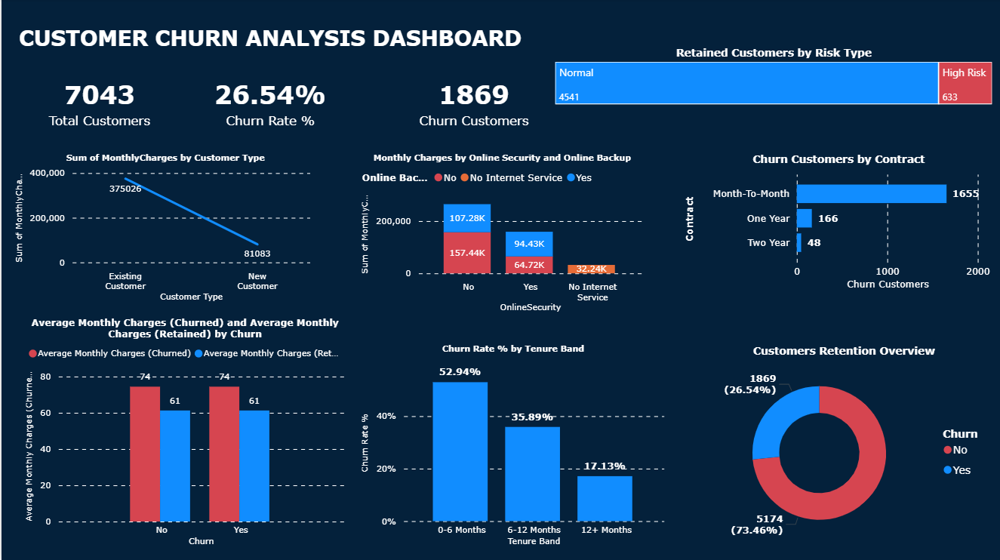

# Customer Churn Analysis Report

## Business Problem

A telecom provider was experiencing significant customer churn and needed to identify:

- Which customer segments were leaving
- Why they were leaving
- Where to focus retention efforts first

The objective was to build an end-to-end churn analysis solution using Power BI that transforms raw customer data into actionable insights for reducing churn and protecting recurring revenue.

## Data Quality Issues & Solutions

| Issue | Solution |
|-------|----------|
| ~5 duplicate customerID rows | Removed duplicates to ensure each customer is counted once; prevents overstated KPIs |
| Inconsistent text values (e.g., "month to month", "month-to-month") | Standardized to "Month-To-Month"; applied Trim/Clean on all text fields |
| Incorrect data types for tenure, MonthlyCharges, TotalCharges | Converted to numeric formats for accurate aggregation and LTV calculations |
| Null values in TotalCharges | Replaced nulls with 0 only when MonthlyCharges had a value (indicating new customers) |
| Logical contradictions (e.g., PhoneService="No" but MultipleLines="Yes") | Fixed to prevent impossible service combinations |

## Data Modelling & DAX Measures

### Core DAX Measures Created

- **Total Customers** — COUNTROWS(telco_churn)
- **Churn Customers** — CALCULATE(COUNTROWS(telco_churn), telco_churn[Churn] = "Yes")
- **Retained Customers** — CALCULATE(COUNTROWS(telco_churn), telco_churn[Churn] = "No")
- **Churn Rate %** — DIVIDE([Churn Customers], [Total Customers], 0)
- **Average Monthly Charges** — AVERAGE(telco_churn[MonthlyCharges])
- **Avg Monthly Charges (Churned)** — CALCULATE(AVERAGE(telco_churn[MonthlyCharges]), telco_churn[Churn] = "Yes")
- **Avg Monthly Charges (Retained)** — CALCULATE(AVERAGE(telco_churn[MonthlyCharges]), telco_churn[Churn] = "No")

### Calculated Columns

1. **Tenure Band** (0–6, 6–12, 12+ months) — shows churn evolution over customer lifecycle
2. **Customer Type** (New vs. Existing) — separates early-life churn from long-term satisfaction issues
3. **Risk Type** (High Risk vs. Normal) — based on month-to-month contracts + low tenure for targeted retention

## Dashboard Design

### Layout: Single-page, KPI-first design

- **Top Row:** KPIs answering "How big is the churn problem?"
- **Middle Section:** Visuals explaining "Where is it coming from?" (contract, tenure, services)
- **Bottom Section:** Retention vs. churn proportion

### Visual Choices by Question

| Visual Type | Purpose |
|-------------|---------|
| Column charts | Churn rate by Tenure Band (highlights churn drop after 12 months) |
| Bar charts | Churn by Contract + MonthlyCharges sums (ranks revenue impact) |
| Donut chart | Retention overview (quick churn vs. active customer share) |

**Theme:** Dark background with contrasting colors for churned vs. retained segments

## Dashboard Preview

Power BI dashboard highlighting churn rate, segment risk, and retention drivers.

## Key Insights

### 1. New Month-to-Month Customers Are the Critical Pain Point

| Metric | Value |
|--------|-------|
| Overall churn rate | ~26.5% (1,869 of 7,043 customers) |
| 0–6 month customers | Churn at above 50% |
| Majority of churned customers | On Month-To-Month contracts |

**Impact:** Focusing on this narrow segment yields large improvements in overall churn.

### 2. Higher Bills Correlate with Higher Churn

| Customer Segment | Average Monthly Charges |
|------------------|------------------------|
| Churned customers | ~74/month |
| Retained customers | ~61/month |

**Impact:** Pricing and plan-fit review for high-charge, short-tenure customers can reduce churn without discounting the entire base.

### 3. Lack of Value-Add Services Signals Churn Risk

- Customers without **Online Security** and **Online Backup** contribute disproportionately to churn

**Impact:** Bundling these services at onboarding increases ARPU and reduces early churn.

## Top 3 Recommended Initiatives

### 1. Onboarding & Save Offers for New Month-to-Month Customers (0–6 Months)

- Trigger welcome journey, service usage nudges, and targeted save offers for High-Risk segment
- **Projected impact:** Even a 5-point reduction in this group retains hundreds of customers annually

### 2. Plan & Pricing Review for High-Charge, Churn-Prone Customers

- Identify customers in top MonthlyCharges quartile + Month-To-Month + <12 months tenure
- Proactively offer plan optimization or loyalty discounts

### 3. Bundle Online Security & Backup in Acquisition Campaigns

- Position add-ons as "starter packs" for new customers
- Monitor churn differences between bundled and non-bundled cohorts

## Dashboard Filters Applied

- **Retained Customers by Risk Type:** "Normal" and "High Risk"
- **Customer Retention:** Churn = "No"
- **Churn Customers by Contract:** "Month-To-Month"

*Report generated for Power BI Customer Churn Analysis Project*
*Data Source: Kaggle Telco Customer Churn Dataset*
